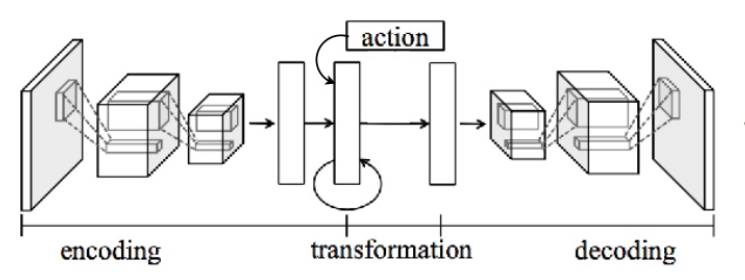
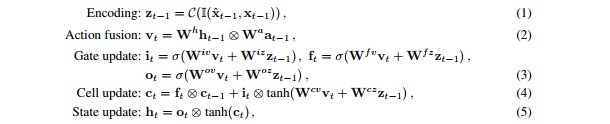

# Recurrent-Environment-Simulators
An implementation of Deepmind recurrent enviroment simulators in tensorflow. 


## Network Architecture 
The following figure visualize the RES architecture. It can be devided to three main parts, the encoder, the decoder and the action-conditioned LSTM. The encoder extract the features from the observation at time step ```t```, the action-conditioned LSTM keeps useful features from previous frames to help the decoder predict better observations for time step ```t+1```.

<div align="center">
<br><br>
</div>


# Action-conditioned LSTM
One of the main contributions of this work is fusing the action with the hidden state representation when predicting the next hidden state representation in time. In previous work, the action was used instead to directly predict the next image. Why? Authors suggest it could “enable the model to incorporate action information more effectively”.
so paper used a modified version of LSTM called Action conditioned LSTM.
mainly it's an early fusion between actions and states. They used this approach as it enables them to explore how the model generalises to different action policies.


<div align="center"> 
<br><br>
</div>

## Data Collection using A2C RL agent
We trained a synchronous Advantage Actor Critic (A2C) agent and used it to explore the desired enviroment and collect data, using openAi Atari enviroments.


## Usage
  #### Dependencies
```
Python 3.X
tensorflow 1.3.0
numpy 1.13.1
tqdm
```

#### Run

- Collect data from any atari enviroment using the method mentioned before, or use the provided data.
- Run ```python res.py is_train=True```


