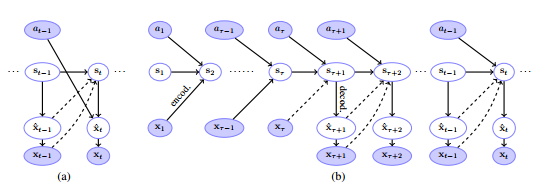

# Recurrent-Environment-Simulators
An implementation of Deepmind recurrent enviroment simulators in tensorflow. 

  

# Action-conditioned LSTM
The paper used a modified version of LSTM called Action conditioned LSTM, mainly it's an early fusion between actions and states. They used this approach as it enables them to explore how the model generalises to different action policies.

  

## Usage
 
### Training monitoring 

.........

### Model Output

### References

